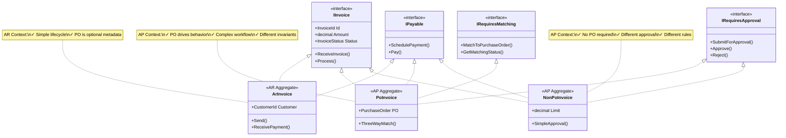

# AR vs AP - Domain-Driven Design with Liskov Substitution Principle

Based on decision.txt - A proper DDD approach that respects LSP

## Overview: Two Separate Bounded Contexts


## AR (Accounts Receivable) - Simple Model


## AP (Accounts Payable) - Complex Model with Separation


## LSP-Compliant Design Pattern

### ❌ WRONG: Trying to make them subtypes


### ✅ CORRECT: Interface Segregation + Separate Aggregates



## Invariants and Constraints Analysis

### AR Invoice (Simple)

```
Invariant:
  - Amount > 0
  - Customer exists
  - Status ∈ {Draft, Sent, Paid, Cancelled}

Constraint:
  - Status never goes backward (Draft → Sent → Paid)
  - Amount cannot change after Sent
  - PO reference is immutable (optional metadata only)
```

### AP PoInvoice (Complex)

```
Invariant:
  - Amount > 0
  - PurchaseOrder MUST exist (mandatory)
  - Amount ≤ PO.ApprovedAmount
  - MatchingStatus ∈ {Pending, Matched, Mismatched}
  - ApprovalStatus ∈ {Pending, Approved, Rejected}

Constraint:
  - PO cannot be changed after creation
  - Cannot pay before matching is complete
  - Cannot pay before approval
  - Matching → Approval → Payment (strict order)
```

### AP NonPoInvoice (Different Complex)

```
Invariant:
  - Amount > 0
  - Amount ≤ SpendingLimit
  - ApprovalStatus ∈ {Pending, ManagerApproved, FinanceApproved, Rejected}

Constraint:
  - No PO matching required
  - Manager approval → Finance approval (different workflow)
  - Cannot pay before final approval
```

## Why They Cannot Be Subtypes

| Aspect | AR Invoice | AP PoInvoice | LSP Issue |
|--------|-----------|--------------|-----------|
| **PO Requirement** | Optional metadata | Mandatory, drives behavior | Strengthened precondition ✗ |
| **Amount Validation** | Any amount | Must ≤ PO.ApprovedAmount | Additional constraint ✗ |
| **Processing** | Send → Wait → Receive | Receive → Match → Approve → Pay | Different workflow ✗ |
| **Invariants** | Simple | Complex with PO dependencies | Cannot substitute ✗ |
| **Constraints** | Linear status progression | Multi-stage approval + matching | Different history properties ✗ |

## Repository Pattern

### AR Context - Single Repository

```csharp
public interface IInvoiceRepository
{
    Task<Invoice> GetByIdAsync(InvoiceId id);
    Task<IEnumerable<Invoice>> GetByCustomerAsync(CustomerId customerId);
    Task<IEnumerable<Invoice>> GetOverdueAsync();
    Task SaveAsync(Invoice invoice);
}
```

### AP Context - Separate Repositories

```csharp
public interface IPoInvoiceRepository
{
    Task<PoInvoice> GetByIdAsync(InvoiceId id);
    Task<IEnumerable<PoInvoice>> GetPendingMatchingAsync();
    Task<IEnumerable<PoInvoice>> GetPendingApprovalAsync();
    Task<IEnumerable<PoInvoice>> GetByPurchaseOrderAsync(string poNumber);
    Task SaveAsync(PoInvoice invoice);
}

public interface INonPoInvoiceRepository
{
    Task<NonPoInvoice> GetByIdAsync(InvoiceId id);
    Task<IEnumerable<NonPoInvoice>> GetPendingApprovalAsync();
    Task<IEnumerable<NonPoInvoice>> GetByVendorAsync(VendorId vendorId);
    Task SaveAsync(NonPoInvoice invoice);
}
```

## Decision Table


## Key Insights

### Why This Respects LSP

1. **No False Inheritance**: AR Invoice and AP PoInvoice are NOT subtypes
2. **Interface Segregation**: Each type implements only the interfaces it needs
3. **Proper Invariants**: Each aggregate has its own invariants without conflicts
4. **Separate Constraints**: Different history properties for different contexts
5. **No Precondition Strengthening**: Each type defines its own requirements

### Why Separate Collections Make Sense

```
AR Invoice Collection:
- Simple queries: by customer, by due date, overdue
- Straightforward indexing
- No complex joins

AP PoInvoice Collection:
- Complex queries: by PO, by matching status, by approval status
- Different indexes needed
- Often needs joins with PO system

AP NonPoInvoice Collection:
- Different queries: by approval workflow stage
- Different performance characteristics
- Different archival rules
```

### The DDD Insight

> **"Even if they share the word 'Invoice' and similar fields, AR and AP are DIFFERENT BOUNDED CONTEXTS with different ubiquitous language, different invariants, and different business rules. Sharing implementation is a design smell."**

## Summary

- **AR**: Single aggregate, optional PO, one collection ✓
- **AP**: Separate aggregates driven by PO requirement, separate collections ✓
- **LSP**: Respected by NOT forcing inheritance where contracts differ ✓
- **DDD**: Proper bounded context separation ✓
