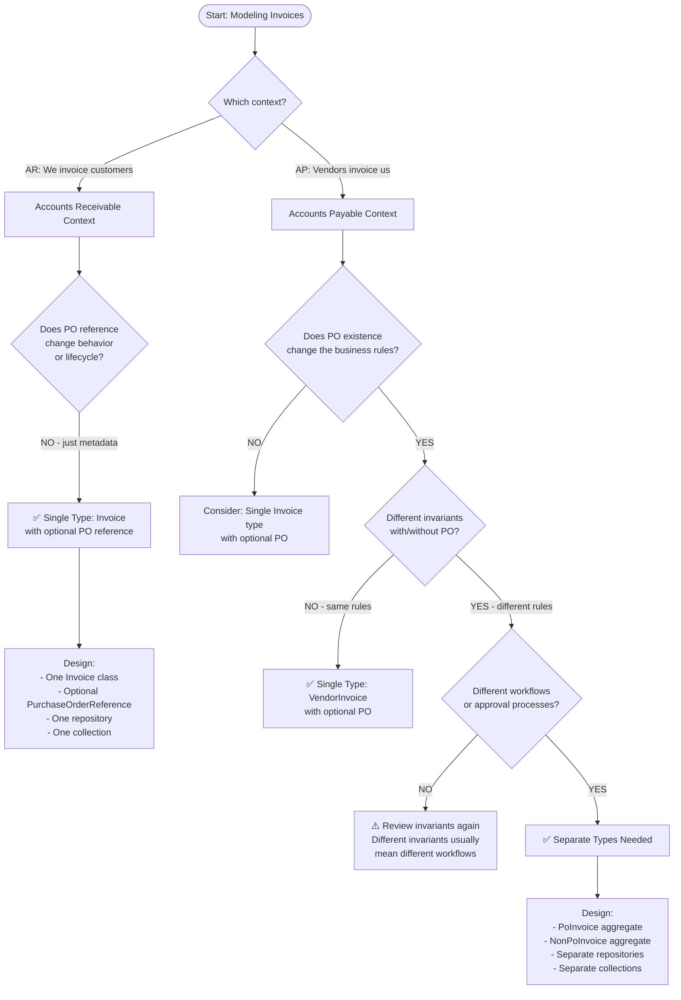

# Invoice Type Design Decision - DDD Perspective

## Decision Flow: Should You Create Separate Types?

```mermaid
flowchart TD
    Start([Start: Modeling Invoices])

    Context{Which context?}
    Start --> Context

    Context -->|AR: We invoice customers| AR[Accounts Receivable Context]
    Context -->|AP: Vendors invoice us| AP[Accounts Payable Context]

    %% AR Decision Path
    AR --> ARQ{Does PO reference<br/>change behavior<br/>or lifecycle?}

    ARQ -->|NO - just metadata| ARSingle[✅ Single Type: Invoice<br/>with optional PO reference]

    ARSingle --> ARDesign[Design:<br/>- One Invoice class<br/>- Optional PurchaseOrderReference<br/>- One repository<br/>- One collection]

    %% AP Decision Path
    AP --> APQ1{Does PO existence<br/>change the business rules?}

    APQ1 -->|NO| APSingle[Consider: Single Invoice type<br/>with optional PO]
    APQ1 -->|YES| APQ2{Different invariants<br/>with/without PO?}

    APQ2 -->|NO - same rules| APSingleConfirm[✅ Single Type: VendorInvoice<br/>with optional PO]
    APQ2 -->|YES - different rules| APQ3{Different workflows<br/>or approval processes?}

    APQ3 -->|NO| APCheck[⚠️ Review invariants again<br/>Different invariants usually<br/>mean different workflows]
    APQ3 -->|YES| APSeparate[✅ Separate Types Needed]

    APSeparate --> APDesign[Design:<br/>- PoInvoice aggregate<br/>- NonPoInvoice aggregate<br/>- Separate repositories<br/>- Separate collections]

```
